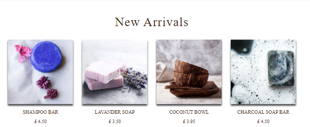

# **EcoShop**

The plastic waste is a big problem for our world and it is one of the biggest factor to climate change from when it is produced to going to our bins, unfortunately governments and big companies are not taking effective action therefore it is down to us to show them we are choosing zero waste path as an indivual. EcoShop is offering the alternative products to use in our daily lives from toothbrush to shampoos

# Table of Contents

1. [User Experience](#user-experience)

    - [Goals](#goals)
      - [Visitor Goals](#visitor-goals)
      - [Busines Goals](#busines-goals)
      - [Design](#design-choices)
2. [Features](#features)
    - [Existing Features](#existing-features)
    - [Features Left to Implement](#features-left-to-implement)
3. [Wireframes](#wireframes)
4. [Data Modeling](#data-modeling)
5. [Technologies Used](#technologies-used)
    - [Frontend Technologies](#front-end-technologies)
    - [Backend Technologies](#back-end-technologies)
6. [Testing](#testing)
7. [Deployment](#deployment)
    - [Local Deployment](#to-run-this-project-locally)
    - [Remote deployment](#remote-deployment)
8. [Credits](#credits)
9. [Acknowledgements](#acknowledgements)


## **User Experience**
***

## Goals
---
### Visitor goals
The target audience to this website  
  * Any household who are aware of the vast amount of
plastic used in daily products and want to reduce their footprints.

### Busines Goals
Attract the customers who are interested buying eco products. Convince them that they are making the right decision and keep them happy after purchase so they will return to the website.  

As a user I would like  
* be able to see a list of products in categories so I can easily search and add to my cart what I am looking for.
* to see the products in detail so I can decide whether or not I want.  
* to be able to see if I succeed to add the product to my cart.
* to be able to access the website from any device
* the website to be easy to use.
* to be able to easily register for an account.
* to be able to view my order history.
* to be able to recover my password if I forget it.
* to receive an email after registering
* to be able to leave product reviews.
* to be able to search product with keywords.
* to be able to sort the products by categories ore price for efficient search.
*  to be able to select quantity of the product to add to the cart.
* to be able to contact to the business owner if any problem arise

As a owner I would like
* to provide well designed, user-friendly platform that will benefit my business to advertise on
* to have interface that is user friendly for me to add, remove or edit a product. The admin can do that on the products or product detail page with superuser login.  
* to be able to store and see the user reviews. User has to login to leave a review so that the owner can track and store user reviews
* to be able to add, change a code for discount coupons. This can be done through the admin console on the website 

## **Design Choices**
---
I tried to create a overall user friendly design with EcoShop website. I wanted to encoruge the user to shop with confidence with that in mind I attempt to use a common ecommerce website structure.


### **Fonts**
* For the primary font I used GoogleFonts PT+Serif as a main font and Lora for headings I thought it would fit with the website. 

### **Colour**


* I have created the color palette using the hero image on the website with [colors.co](https://coolors.co/006d77-83c5be-edf6f9-ffddd2-e29578) palette creator for holistic view. Try to keep the colours consistent to 
* I used the _Darksalmon_ on the buttons, _Ming_ colour for heading and logo, _Bistre_ for font colour, _Seashell_ for footer and About sections.

### **Styling**
* The brand logo is important as it welcomes the customer when they land in to the website. I created the logo to represent nature and elegance using Canva website. 
* All buttons on the site fit the same bootstrap button styling in size and shape, but I added the colours I used in this project to them, so they fit in with the rest of the content.
* Material Design for bootstrab `MDB` Card design used on Products page included _Add To Cart_. The card shows image and price of the product.

## **Features**
---
### **Element on every page**

* **Top Header**
    * On the left of the header you can see the brand logo    
       
    * Links for the users and search bar on the middle range and the _All Product_ which is a dropdown take you to product page andsort the products in range such as `By Price`, `By Category`. _Categories_ such as `Kitchen`.   
    
    * The navbar is collapsed into a burger icon on small and medium sized screens and the logo disappears there fore _Home_ button appears on the dropdown menu  
      
    * Search box function allows the visitors to search the products on online shop with keywords. The keywords are searched over name and description field of Product Model. it collapses to magnified icon on small and medium sized screens.
    * On the right corner there is user icon it is a dropdown button gives `Register` and `Login` options. If the user is logged in `My Profile` and `Logout`. If the user is superuser `Product Management ` option will also appear.

* **Footer**
  * Logo which is link to the home page
  * A list of navigation links users might need when viewing the footer.
  * Copyright information.
  * Social media links they are not linked at the moment but I will add them once the EcoShop social media platforms are exist.

* **Toasts**
  * Bootstrap toast feature is used to inform the user. There are 4 types of notification user can see `success`, `error`, `info` and `warning` each one of them has different colour and heading with different messages.

  

## **Existing Features**
### **Home Page**
The homepage is the most visited place in the webstore. It’s the page from where the customers start exploring the storefront. I want to excite the customers with my homepage content by highlighting my best-selling product, special offer and new items.
To fulfil that purpose, I added 20% discount modal, new arrival row and popular categories row.  
* A modal pops up in 3 second, gives enough time to the user a glimpse of the page before the modal pops in.

* Homepage welcomes the user with free delivery treshold banner and navigation bar.
* Hero image choosed from [canva](canva.com) There is a motto emphasis "why you should shop on this website" and a `Shop Now` button completes the image.

* New arrival row I added a line of code to the `home` app `views.py` which calls last added 4 items to the website.

* About us section introduce the site to the visitor 
* Popular categories is inprogress part of the page. It is static at the moment but in future will call the most clicked categories to the home page.
### **Product Page**
 You can come to this page either `Shop Now` button on the home page or `All Products` link from the navigation bar. Also, you can see categorised version.
 * As you land to the product page you can see how many products exist in this webstore on the left corner. On the right corner you can sort all the products by `price`, `name` and `category`
 * Each product is in a `MDB` card feature which has an image the product name and Add to cart button. If you are a `superuser` you can also `add` or `delete` a product from this page.
 
 * A floating button appears on the lower right of the screen when the user starts to scroll downwards. Clicking this moves the view back up to the top of the page. This added because as products populates only one page, the page can be quite long, and this gives option to go to top without scrolling manually. I influenced the scroll top button from [W3S](w3school.com)
 ### **Product Detail Page**
 * From the products page user can click to any product to see the details of it and choose quantity then `Add To Cart`.
 * Authenticated user, can leave a comment, and rate the product. If the user is not signed in, they can see the reviews and count of them but can't see the "review form" instead they are encouraging to login to leave a review.
 * If the user leaves a review this will appear with user name and user icon on the left, given rate will fill the stars and it will position next to username. On the next column user can see review headline and review subject. Every review will be divided by `hr` horizantal line.
 * Superuser if authenticated can edit and/or delete the product using `edit` and `delete` buttons which are located next to product rating.

### **Shopping Cart**
* If there is no item in the shopping cart user can see "Your cart is empty" message and `Keep Shopping` button which will take user to products page.
* If the cart has a product on the left side, it shows the products added to the cart. Customers can change the quantity or remove the products in here.
* On the bottom left of the page customer can use a discount coupon code, right now  `DISCOUNT20` will give 20% off of the cart total (delivery is not included to the discount, it will be calculated from the full price).
* On the bottom right, you can see the order summary that shows Cart Total, Delivery and Grand Total. If there is discount coupon applied customer see the before and after the discount. 
* When the customer happy with their cart `Secure Checkout` button take them to the checkout page.

### **Checkout page**
* On the checkout page, customers are asked to fill in delivery details. The customer can complete the checkout process without having an account, if the customer hasn't logged in, the message "Create an account or login to save this information" is shown just before the card details.
* On the right, the customer can see order summary and Order Total, Delivery and Discount (if there is any discount code applied)
* Once the customer filled up their details, they can `Complete Order` finilaze the purchase.

### **Checkout Success Page**
* A thank you message will be displayed after the checkout process and the table that holds the order details.
* Keep Shopping button is placed at the end of the page, and if the user has been logged into their account, Back to Profile will be shown.
### **My Profile Page**
* My Profile page is available for authenticated users and will be shown in the My Account Dropdown menu at the navbar which appears when user log into their account.
* In Profile Page, authenticated users can `Edit` Delivery Information and see Order History.

### **Product Management for Superuser**
* It is limited to authenticated superusers to see the admin page admin can:
  * add products,
  * edit products, 
  * delete products.
* If non-logged in users try to access the url directly, it will redirect to the sign in page. If a non-superuser tries to access the url, an error message pops up which says that only a superuser can access this page.

## **Features Left to Implement**

There are some of features left to implement in the future which I could not add to the project this time due to time constraints. These features are great to be added for a more complete online shop service which would lead to higher customer satisfaction.
1. **Home page modal pop up**: I would like to limit the modal popping only once than everytime user refresh/visits the home page. It is more annoying then attrackting if the user needs to keep click close button.   

2. **Popular categories**: I would like to add a functionality to the this section which will be shown categories the most clicked or added to the cart.
3. **Product page Add to Cart**: User can only add one product at a time from the product page. I am planing to add a modal will pop up a screen with a quantity option. Also, I would like to show user ratings here so customer can see and can sort the products by their ratings.

4. **Reviews**: Right now one user can add as many reviews as they want on any products this can lead a biased opinion. I would like to limit this to a one and whether the user purchased the product they commenting. Also, I would like to user able to add image when they use this product. This will encourage other users to buy the same product.
5. **Social Account Login**: I would like to users be able to sign up / log into their account of the site, using an existing third party account such as Facebook and Twitter. This is beneficial to users and the site owners. For users, it's hassle free for remembering a password for the site and it gives the users a smooth registration process. For the site owners, there are many benefits gained by social login - such as increasing user sign ups, reducing bounce rate and gaining a user's social account details which is beneficial for marketing purpose.
6. **Coupon code**: It would be useful if the admin can set time and or put conditions to the codes such as "first purchase". In future I will add this option to the admin section.
7. **News Letter**: News letter is one of the best way advertise your products and inform customers about discounts so they will more often visit your shop this will rise of their purchase rate.
# **Wireframes**
These wireframes were created using Balsamiq during the Scope Plane part of the design and planning process for this project.  
* [Home Page](readme-doc/Home-Page.png) 
  * [Mobile Version](readme-doc/Mobile-home.png)
* [Products Page](readme-doc/Product.png)
  * [Mobile Version](readme-doc/Mobile-Product.png)
* [Product Detail Page](readme-doc/Product-details.png)
  * [Mobile Version](readme-doc/Mobile-product_details.png)
* [Cart Page](readme-doc/Cart.png)
    * [Mobile Version](readme-doc/Mobile-Shopping-Cart.png)
* [Checkout Page](readme-doc/Checkout.png)
  * [Mobile Version](readme-doc/Mobile-Checkout.png.png)
* [Register Page](readme-doc/Register-page.png)
  * [Mobile Version](readme-doc/Mobile-Registerpage.png)
* [My Profile Page](readme-doc/My-Profile.png)
  * [Mobile Version](readme-doc/Mobile-My-Profile.png)

# **Data Modeling**
* As database development phase SQLight was used which is installed with Django.

* Deployment phase PostgreSQL was used on deployment stage, which is provided as add-on by Heroku application.
* Following is Entity Relationship Diagram of this project. This diagram created on [Moqup Webapp](https://app.moqups.com)  


### **Product**
Each product has `sku`, `name`, `description`, `price` and `image` field eache product can be categorised as `kitchen`, `bathroom`, `on-the-go` and `skin-care`. The search option will only work for products and it is not limited only product name user can only search a word in description.
### **Order**
Order Model - This is populated when user completes the checkout. The details entered in the checkout will populate this model as well as custom calculations for `total amount` and `discount` and `delivery charge` also collects the delivery information, `stripe_pid` and `order` information. All the fields except `user_profile` field have `null=false`. The reason why user_profile does not have null=false is that guest customers (not authenticated users) can also purchase products and complete the checkout process without creating an account. Order model is connected to OrderLineItem model which collects information.


## **Technologies Used**
### **Front-End Technologies**
  * HTML
  * CSS
  * Javascript
  * JQuery
  * [Bootstrap](https://getbootstrap.com/)
  * [Google Fonts](https://fonts.google.com/) 
  * [Fontawsome](https://fontawesome.com/)    
### **Back-End Technologies**
* [Django](https://www.djangoproject.com)  
* [Django Crispy Form](https://django-crispy-forms.readthedocs.io/en/latest/)
* [Django allauth](https://django-allauth.readthedocs.io/en/latest/)
* [Gitpod](http://gitpod.io/)
* [Github](https://github.com/ozluna/EcoShop)
* [Jinja](https://jinja2docs.readthedocs.io/en/stable/)
* [Stripe](https://stripe.com/ie) 
* [Heroku](https://id.heroku.com/login)
* [Python](https://www.python.org/)
* [PIP](https://pip.pypa.io/en/stable/installation/)
* [AWS S3 Bucket](https://aws.amazon.com)


## **Testing**
Testing information can be found here [Testing.md](Testing.md)

## Bugs

# **Deployment**

## To run this project locally

In order to run this project locally, you will need to install the following:
* An IDE, such as VS Code
* PIP3 to install the app requirements.
* Python3 to run the application
* GIT for version control  
Once this is done:   
* Navigate to Mainpage of the repository
* Click on "Code" button
* Choose "Clone with HTTPs" & copy URL
* Open Terminal
* Change the current working directory to prefered location
* Type git clone and past copied URL git clone `git@github.com:ozluna/EcoShop.git`
* Press Enter to create local Clone - Make sure your environment supports `python3` -
* On Terminal type `pip3 install -r requirements.txt`
* Setup the environment variables. This process is differnet depending on the used IDE. Gitpod supports global Environments for the development process. Therefore they were stored in the settings. The following variables are needed

```
    DEVELOPMENT=True   
    SECRET_KEY = <YOUR SECRET KEY>
    STRIPE_PUBLIC_KEY = <YOUR STRIPE_PUBLIC_KEY>
    STRIPE_SECRET_KEY = <YOUR STRIPE_SECRET_KEY>
    STRIPE_WH_SECRET = <YOUR STRIPE_WH_SECRET>
```  
> I used this website to generate secret key [Key generator](https://miniwebtool.com/django-secret-key-generator/)

* Import the provided fixtures in the following order  
`python3 manage.py loaddata categories`  
`python3 manage.py loaddata products`

* Migrate the models and create the database by typing the following commands into the terminal:  
`python3 manage.py makemigrations`  
`python3 manage.py migrate`  

* Create a superuser for accessing the django admin view with the following command:  
`python3 manage.py createsuperuser`  
* You will need to use an email address, username and password.
* You should be all set and when using the command  
 `python3 manage.py runserver` it will pop up open browser screen.
* You can access the django admin view by adding ~/admin to the end of your (local) URL.

## Remote Deployment

Once you Locally deployed this project you can follow this steps.
* First of all you will need to have a heroku account and name your app.
* Create requirements.txt from your project with the help of pip3 freeze --local > requirements.txt 
* Create a Procfile and type following:
```
 echo web: gunicorn EcoShop.wsgi:application
````
* Then from you environment remotely connect to this heroku account by typing `heroku login -i`
* Commit changes to Git `git add .`  `git commit -m " with a comment"`
* Set the environment variables in Heroku Settings > Reveal Config Variables The following Variables must be set:  

| KEY                  | VALUE                              |
| :---                 |    :----:                          |
| USE_AWS              | TRUE                               |
|DEVELOPMENT           | TRUE                               |
| AWS_ACCESS_KEY_ID    | YOUR_ACESS_KEY                     |
| AWS_SECRET_ACCESS_KEY| YOUR_SECRET_ACCESS_KEY             |
| DATABASE_URL         | YOUR_DB_URL                        |
|STRIPE_PUBLIC_KEY     | YOUR_STRIPE_PUBLIC_KEY             |
|STRIPE_SECRET_KEY     | YOUR_STRIPE_SECRET_KEY             |
|STRIPE_WH_SECRET      | YOUR_STRIPE_WH_SECRET              |
|EMAIL_HOST_PASS       | YOUR_EMAIL_HOST_PASS               |
|EMAIL_HOST_USER       | YOUR_EMAIL_HOST_USER               |

* Comment out the current database setting in settings.py, and add the code below instead. This is done temporarily to migrate the datbase on Heroku.
* Import the provided fixtures in the following order  
`python3 manage.py loaddata categories`  
`python3 manage.py loaddata products`

* Migrate the models and create the database by typing the following commands into the terminal:  
`python3 manage.py makemigrations`  
`python3 manage.py migrate`  

* Create a superuser for accessing the django admin view with the following command:  
`python3 manage.py createsuperuser`  
* Replace the database setting with the code below, so that the right database is used depending on development/deployed environment.
```
if 'DATABASE_URL' in os.environ:
    DATABASES = {
        'default': dj_database_url.parse(os.environ.get('DATABASE_URL'))
    }
else:
    DATABASES = {
        'default': {
            'ENGINE': 'django.db.backends.sqlite3',
            'NAME': os.path.join(BASE_DIR, 'db.sqlite3')
        }
    }
```
* Disable collect static, so that Heroku won't try to collect static file with: `heroku config:set DISABLE_COLLECTSTATIC=1`
* Add `ALLOWED_HOSTS = ['ecoshop-oz.herokuapp.com', 'localhost']`
* In Stripe, add Heroku app URL a new webhook endpoint.
* Update the settings.py with the new Stripe environment variables and email settings.
* Commit all the changes to Heroku. Medial files are not connected to the app yet but the app should be working on Heroku.
* From now on if you make any changes on your models you should run this code to migrate to heroku `heroku run python3 manage.py migrate`

* We used AWS for holding static and media files to work this Amazon web services bucket configuration  
* Install `boto3` and django-storages with a command `pip3 install boto3` and `pip3 install django-storages` in your terminal, to connect AWS S3 bucket to Django.
* Add 'storages' to INSTALLED_APPS in settings.py. and add following code to your settings.py:
```
  # Bucket config
if 'USE_AWS' in os.environ:
    #Cache control
    AWS_S3_OBJECT_PARAMETERS = {
        'Expires': 'Thu, 31 Dec 2099 20:00:00 GMT',
        'CacheControl': 'max-age=94608000',
    }
    AWS_STORAGE_BUCKET_NAME = 'ecoshop-oz'
    AWS_S3_REGION_NAME = 'eu-west-2'
    AWS_ACCESS_KEY_ID = os.environ.get('AWS_ACCESS_KEY_ID')
    AWS_SECRET_ACESS_KEY = os.environ.get('AWS_SECRET_ACCESS_KEY')
    AWS_S3_CUSTOM_DOMAIN = f'{AWS_STORAGE_BUCKET_NAME}.s3.amazonaws.com'

    # Static and media file
    STATICFILES_STORAGE = 'custom_storages.StaticStorage'
    STATICFILES_LOCATION = 'static'
    DEFAULT_FILES_STORAGE = 'custom_storages.MediaStorage'
    MEDIAFILES_LOCATION = 'media'

    # Override static and media URLs in production
    STATIC_URL = f'https://{AWS_S3_CUSTOM_DOMAIN}/{STATICFILES_LOCATION}/'
    MEDIA_URL = f'https://{AWS_S3_CUSTOM_DOMAIN}/{MEDIAFILES_LOCATION}/'
```
## **Credits**
Product page card design and footer design from [MDB](https://mdbootstrap.com/)  
Scroll top feature is from [W3](https://www.w3schools.com/howto/howto_js_scroll_to_top.asp)  
Canva was used to create the logo [Canva](https://www.canva.com/)  
For Coupon code model and functionality I have used [protutorialplus](http://www.protutorialplus.com/django-shopping-cart), [JustDjango](https://www.youtube.com/watch?v=otoKdW-lYc8&t=539s)  tutorials   
For Review model and functionality [Onthir](https://www.youtube.com/watch?v=lSX8nzu9ozg&list=PLeyK9Dw9ShReHUdt5Nh2qlgF6keN6DI7z&index=32) tutorials  
Star rating [this website](https://webdesign.tutsplus.com/tutorials/a-simple-javascript-technique-for-filling-star-ratings--cms-29450)  
For responsiveness I used [Boostrap](https://getbootstrap.com/)  
For fonts I used [Google Fonts](https://fonts.google.com/)  


## **Acknowledgements**

In the process of finishing this website I used many resources, mainly; MDN web docs, W3Schools, Stack Overflow.  
Youtube channels such as Travers media, online resources [goalkicker](https://goalkicker.com), code institute videos and last but not least my mentor and tutors help.


