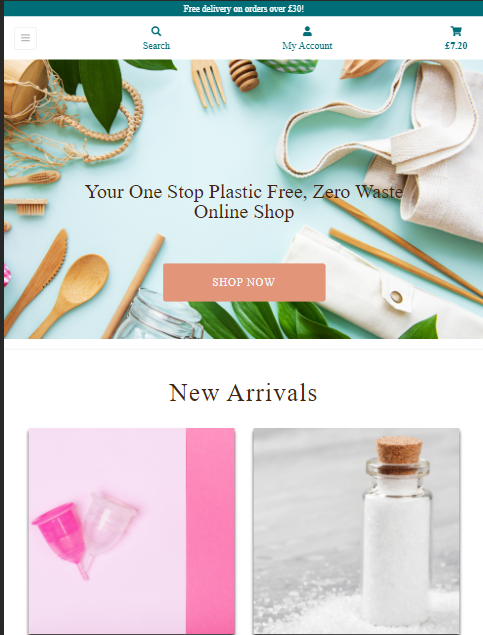
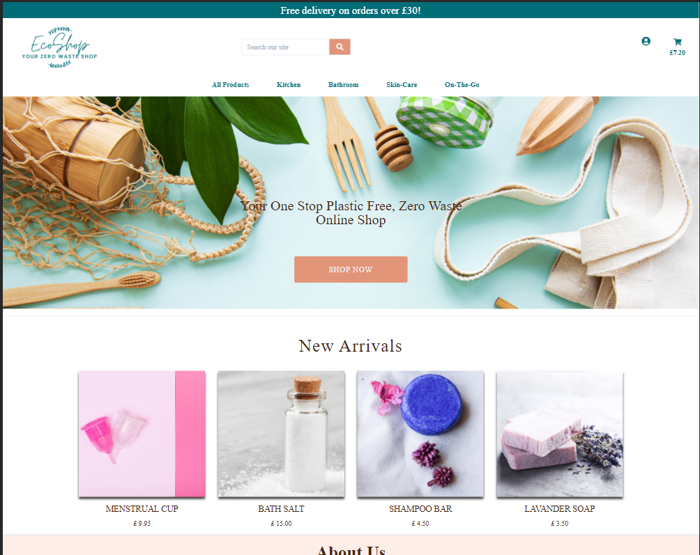
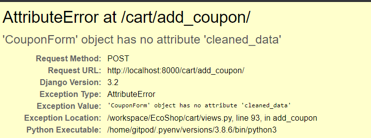

# **Testing**
## **Automated Testing**
---
[W3C HTML Validator](https://validator.w3.org/) used to validate the html codes (I ignored the error caused by jinja).  


 [W3C CSS Validator](https://jigsaw.w3.org/css-validator/)  
 [CSS Beautifier](https://codebeautify.org/css-beautify-minify)

[JSHint](https://jshint.com/) 
I tested Javascript 


I used Flake8 for python testing using following:  
`python3 -m flake8`

## Responsiveness
---
**User Stories Tested**:
As a user I would like to be able to:
* Access the website with any devices to be able to use the website anytime and anywhere.
* Find that all the important services are accessible from nav bar.  
* See a shopping cart icon on nav bar so I can always check the current order and checkout when I want.

### Test conducted:
Access each page in the site with different screen sizes with Google Dev Tool's Emulator and check the layout and format of site elements.

### Phone version  
         

### Tablet Version   
      


### Desktop Version


I had horizontal scroll problem and I was able to see the problem causing this with following JS code:

```
$.each($('*'), function() {
     if ($(this).width() > $('body').width()) { console.log($(this).get(0)); 
     } }).length;
```
### Conclusion: 
* Users can navigate the whole site through navbar. 
* They can access products by category search in products login or register account and go to their shopping cart.
* They can see the website without needing horizantal scrolling
 

## Home Page
---
**User Stories Tested**:
As a user I would like to easily see what services are offered and find the service I want to use. I would expect all the buttons to work.

### Test conducted:
* Click all the buttons and links on the page.
  
### Conclusion:  
Every link is working appropriately.

## Products Page
---
**User Stories Tested**:  
 As a user I would like to
* Search a product with keywords so I can find the most appropriate products.
* See individual product pages that have prices, descriptions, etc to get detailed information about the product before purchasing.
* Filter with a specific category of product so I can easily find products in a specific category.
* See product reviews with scores to understand what are the other users thoughts which could help me in my decision to buy.

### Test conducted:
* Use various keywords in keyword search and check if it works as expected.
* Check if the Product page / product_details page are displayed without breaking the layout for common screensizes.
* Navigations such as breadcrumb, back to previous page button, etc, do not break accessing by different paths.
* Check if the quantity counter work as expected and gives an informative error message if the number is outside of the range (1-99).

### Conclusion:
* Product page displayed as expected but product cards had issues on different screen sizes. This was fixed by giving different width and used bootstrap classes (text-center, etc).
* No issues encounter breadcrumbs and back previous page testing.

## Shopping Cart
---
**User Stories Tested**:  
As a user I would like to be able to   
* Easily select the quantity of a product after adding a product to a cart and remove it in order to ensure I do not accidentally select the wrong product and the quantity.
* Easily find and use appropriate code to get promised discount and be informed if the code is acceppted and the new amount I supposed to pay so I can decide whether or not I want to continue with the purchase.

### Test Conducted
* Check if the quantity counter works propely and gives an error message if the number is out side of the range (1-99).
* Check if Remove/Update link works properly.
* Check if the Coupon code works

### Conclusion:  
* The quantity counter works as expected.
* Remove/Update link works as expected.
* Enter several code `DISCOUNT20` which is 20% promised discount as well as `DISCOUNT10` recieved appropriate messages.
* Code form was `bootstrap card` class but somehow it was not responsive so I had to remove the card class.

## Checkout Page
---
**User Stories Tested**  
As a user I would like to be able to:

* Automatically be suggested to log in if I did not log-in in order to smoothly proceed with my purchase.
* Be informed when the purchase is over.

As a shop owner   
* I would like my customers to be able pay with their card whith secure payment whether or not authenticated.

### Test Conducted
* Access the checkout page after adding some items to the cart with/without logging in.
* Complete the checkout page with different test card using stripe documentation
    * No authentication (default U.S. card): `4242 4242 4242 4242`
    * Authentication required: `4000 0027 6000 3184`.

### Conclusion: 
* If not logged in, a message appears at the end of the form: _"Create an account or login to save this information"._
* All the webhooks in Stripe returned success after the checkout.
* The customer received the order confirmation email to the email address that was added to the checkout page.
* Users are directed to `Checkout success page` displayed order info informing a mail is sent.
 

## SignIn and Order History
---
**User Stories Tested** 
As a User I would like to be able to:
* Receive an email confirmation after registering to verify that my account registration was successful.
* Easily register for an account to have a personal account and be able to view my profile and ability to check my order history.
* Easily recover my password in case I forget it.

### Test conducted:
* Sign up with an email and check if the account receives an email and Log in with the created account.
* Used `forgot password?` link to check if recovering the password works.
* Create a new account and edit the delivery information.

### Conclusion
* Email Address Confirmation email contains site_name and site_domain and they returned the default value 'example.com'.
* Delivery information is updated as expected after alternation in My Profile page.
* Order History Page renders as expected accessing from My Profile page.

## Admin Product Management
---
**User Stories Tested**   
As an admin I would like to be able to:
* Access admin console for the website so I can add new discount code or remove the existing ones.
* Easily edit, remove and add new products.

### Test conducted:
* Access admin console with superuser.
* Add a product with/without image and check if they are acceptable.

### Conclusion
* Admin user redirected to product_detail page they created.
* Admin can edit or delete either from product page or product_detail page.
* Admin can add product from Product Management page

# Bugs
Through the developing stage I had come across many problems but some of them are persistent:  
* On the cart page I created `Coupon` model and `add_coupon` function. On this function I added print codes to test if my code is working or not, when I got it working I wanted to remove this print line however when I remove them I have recieved this error :  



I am very puzzled with this error hence I checked django documentation, ask on Slack, ask tutors, none could find any solution to it. So I kept the print lines as they are, hopefully in the future I will figure out the solution.

* Other problem I have is when I wrote the modal I added the js code to my static folder but recently it stopped working and I had to add the script to my html to get it working.

* I am aware that on the PRoduct Model there are imageurl and rating fields which are not used I wanted to get rid of it but I was worried it will break something same reason with friendly name field on category.